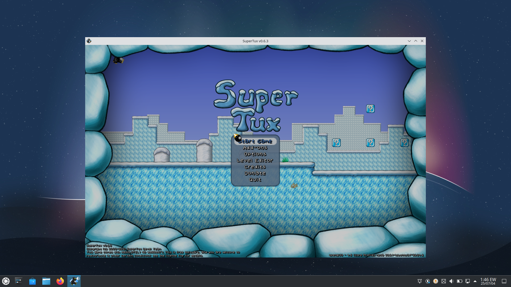

# 🧪 Virtualization Project – Ubuntu Deployment with Penguin Game

## 🎯 Overview

This was a group-based school project focused on **virtualization**. Our objective was to create a fully functional **virtual machine**, install an operating system of our choice, and deploy an application within that environment.

We chose to install **Ubuntu OS** and deployed a simple **penguin shooting game** as our application. This project allowed us to understand the fundamentals of virtual machines, OS installation, and collaborative tech workflows.

---

## 💡 What We Did

- Installed **VMware** on our host systems  
- Set up a **virtual environment** and installed **Ubuntu Linux**  
- Installed essential packages and configured system settings  
- Deployed a **penguin game application(SupreTux)** inside the virtual machine  
- Performed a group presentation and demo of the working setup  
- Answered technical and user-based questions from the lecturer and class

---

## 🤝 Collaboration & Teamwork

Throughout the process:
- We met both **in person and online**
- Shared ideas and solved configuration issues together
- I personally asked many thoughtful questions that challenged the group and deepened our understanding
- Presented confidently, and we received a **high score** for the project

---

## 🖥️ Tech Used

- VMware 
- Ubuntu OS  
- Bash / Linux terminal  
- Basic Linux package management (APT)  
- Penguin game (SuperTux)installation and config

---
## 📸 Screenshots

## 🚀 Outcome

The project was a great success and provided:
- Practical experience in working with virtual machines  
- Improved skills in teamwork, system setup, and OS deployment  
- Boosted confidence in presenting and responding to questions

---

## 📁 Group Members

- Incredible Aik (myself)  
- other 10 team mates

---

## 🧠 Lessons Learned

- Virtualization is powerful and widely used in software development  
- Ubuntu setup teaches real-world Linux skills  
- Teamwork and questioning drive deeper understanding

---

## 📫 Connect

Feel free to reach out or explore more on my [GitHub profile](https://github.com/Incredible-Aik)
